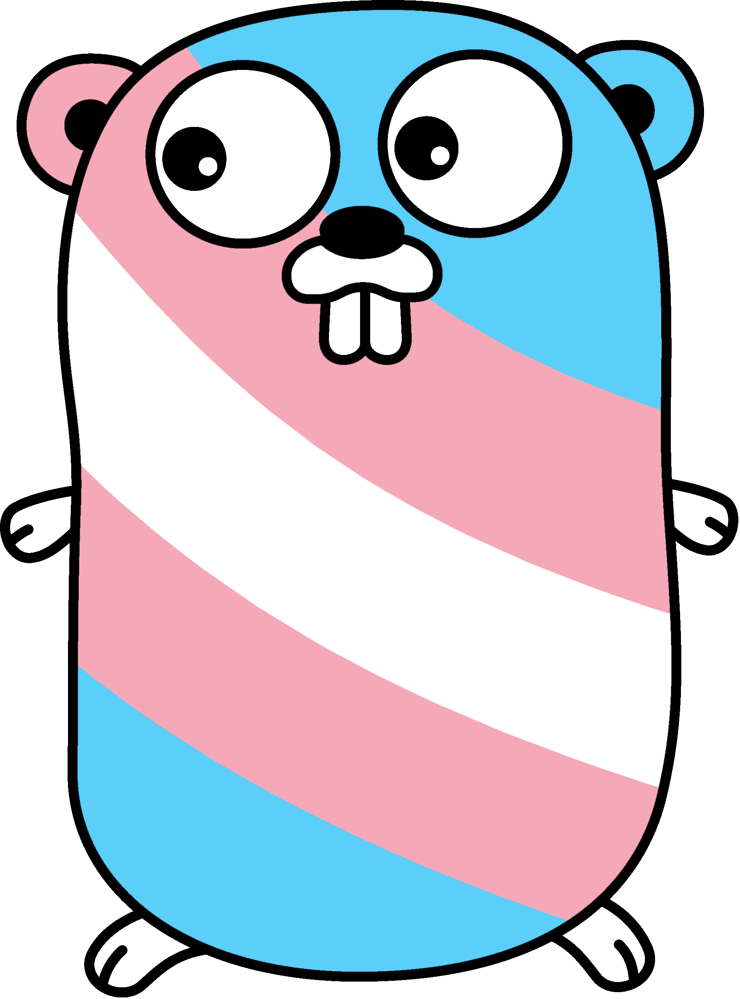

# Trans-Gopher
Show your love of GoLang and trans people with this Trans Gopher!

The original Go gopher was designed by Renee French. (http://reneefrench.blogspot.com/)

This particular gopher design is a modification of an image created by Takuya Ueda (https://twitter.com/tenntenn):
https://github.com/golang-samples/gopher-vector/blob/master/README.md#gopher

My version was made in Photoshop, as a proof of concept. I want to make a vector version of it at some point.

My version is licensed under Creative Commons Attribution 4.0 International (CC BY 4.0).

## What can I do with this?

If you like it, and want to use it, go for it! I've deliberately licensed it such that you can do whatever you like, so long as you credit me with creating this version.

If you use it, and want to give back, please consider making a donation to Women Who Go:
https://www.womenwhogo.org/donations.html

If you want to give money to me specifically:
https://ko-fi.com/lucydavinhart

## Can I just buy it on something pre-made?

I'm still looking for somewhere I can do that, which will let people pay what they want, including a donation to Women Who Go.
If you know of somewhere like that, please let me know!
